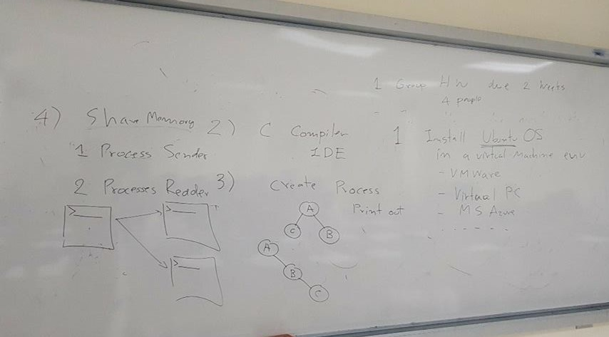
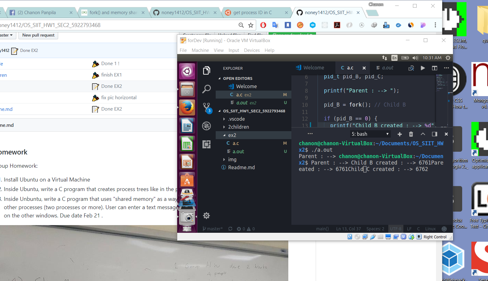

### Homework

Group Homework:

1. Install Ubuntu on a Virtual Machine
2. Inside Ubuntu, write a C program that creates process trees like in the photo above.
3. Inside Unbuntu, write a C program that uses "shared memory" as a way to send data (text message) from one process to other processes (two processes or more). User can enter a text message via command line and the message will appear on the other windows.
   Due date Feb 21 .

## Chanon Panpila 5922793468 I Do it alone B/C My friend have group already.

**Key_Success : ChildProcess**
- ***Negative Value***: creation of a child process was unsuccessful.
- ***Zero***: Returned to the newly created child process.
- ***Positive value***: Returned to parent or caller. The value contains process ID
  of newly created child process.

### ShareMemory 

**Debuging 